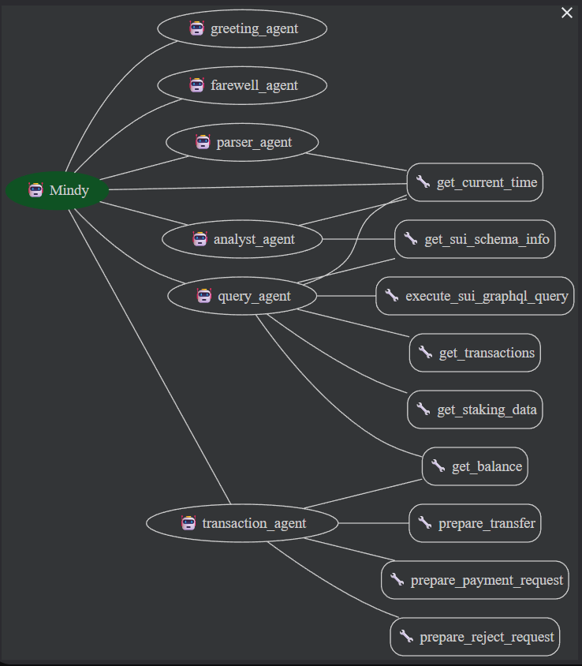

# 🧠 SuiMind: The First Proactive Chat-to-Execute (C2E) Agent on Sui

  

**SuiMind** is not just a wallet you talk to—it's an agent that *acts* for you. 

Powered by **Google Gemini 3.1** and the **Sui Blockchain**, SuiMind transforms natural language into executed financial intents. From sending assets to analyzing complex on-chain data, SuiMind bridges the gap between human thought and blockchain execution.

---

## 🚀 The "Wow" Factor: Why SuiMind?

Traditional wallets are reactive readers. **SuiMind is a proactive executor.**

### 1. Chat-to-Execute (C2E)
Most AI wallets are glorified search engines. SuiMind builds and prepares transactions for you in real-time.
- **You say:** *"Send 10 SUI to Alex for dinner."*
- **SuiMind acts:** Instantly constructs a `TransferObject` transaction, resolves the address, and presents a "Sign Now" card.

### 2. Deep Blockchain Insight (GraphQL-Native)
Don't just check balances. Ask deep questions.
- **You say:** *"How much gas did I spend on transactions last week?"*
- **SuiMind acts:** Dynamically generates complex GraphQL queries to fetch, aggregate, and explain your on-chain history in plain English.

### 3. Multi-Agent Orchestration
We don't rely on a single prompt. SuiMind employs a sophisticated **Multi-Agent System** using the Google Agent Development Kit (ADK):
- **Mindy (Router):** The central orchestrator that routes requests to specialized agents.
- **Greeting/Farewell Agents:** Handle conversational pleasantries.
- **Parser Agent:** Decodes user intent from natural language.
- **Analyst Agent:** Queries live blockchain data and staking APYs.
- **Query Agent:** Executes GraphQL queries for transactions, balances, and staking data.
- **Transaction Agent:** Securely constructs transaction payloads (transfers & payment requests).

---

## ✨ Key Features

### 🗣️ Natural Language Actions
Manage your assets with the speed of thought.
- **Send Assets:** "Transfer 50 USDC to 0x..."
- **Request Payments:** "Create a payment link for 5 SUI from 0x..."
- **Reject Requests:** "Reject that last payment request."

### 📊 Real-Time Staking Intelligence
Stop guessing where to stake. SuiMind fetches **live Validator APY data** directly from the Sui network / fullnodes.
- **Feature:** "What's the current staking APY?" -> Returns real-time validator performance metrics.

### 🎨 Glassmorphic Premium UI
Built with **Next.js 14**, **Tailwind CSS**, and **Framer Motion**, the interface feels like a modern fintech app, not a crypto tool.
- **Visuals:** Frosted glass aesthetics, smooth transitions, and responsive data visualization.
- **Interactivity:** Dynamic "Orb" animations that react to AI thinking states.

---

## 🏗️ Technical Architecture

SuiMind is a hybrid application combining a powerful Python-based AI backend with a reactive Next.js frontend.



### Backend (The Brain)
- **Framework:** Python / Google Agent Development Kit (ADK)
- **Intelligence:** **Gemini 3 Flash** (Optimized for low-latency reasoning)
- **Agents:**
  - `Mindy` (Router)
  - `greeting_agent` / `farewell_agent` (Conversational)
  - `parser_agent` (Intent Extraction)
  - `analyst_agent` (Data Analysis)
  - `query_agent` (GraphQL Execution)
  - `transaction_agent` (Payload Construction)

### Frontend (The Face)
- **Framework:** Next.js 14 (App Router)
- **Styling:** Tailwind CSS + Framer Motion
- **Sui Integration:** `@mysten/sui.js` for signature management and zkLogin.

---

## 🛠️ Getting Started

### Prerequisites
- Docker and Docker Compose (Recommended)
- Node.js 18+ (For manual setup)
- Python 3.10+ (For manual setup)
- A Sui Wallet (e.g., Sui Wallet, Ethos)

### Installation & Running

1. **Clone the Repository**
   ```bash
   git clone https://github.com/Elivius/SuiMind.git
   cd SuiMind
   ```

#### Option A: Docker (Recommended)

2. **Set up Environment Variables**
   - Create a `.env` file in the `ai-agents/` directory and add your Google API key:
     ```env
     GOOGLE_API_KEY=your_api_key_here
     ```

3. **Run the Application**
   ```bash
   docker-compose up -d
   ```
   - The **Frontend** will be available at `http://localhost:3000`
   - The **AI Backend** will be available at `http://localhost:8080`

#### Option B: Manual Setup

2. **Setup AI Backend**
   ```bash
   cd ai-agents
   python -m venv .venv
   source .venv/bin/activate  # or .venv\Scripts\activate on Windows
   pip install -r requirements.txt
   ```
   *Create a `.env` file in `ai-agents/` with your `GOOGLE_API_KEY`.*

3. **Setup Frontend**
   ```bash
   cd ../frontend
   npm install
   ```

4. **Run the Application**
   - **Backend:** `python run.py` (Runs on port 8080)
   - **Frontend:** `npm run dev` (Runs on port 3000)

---

## 🏆 Hackathon Notes
SuiMind challenges the status quo of "Chatbots in Crypto." By focusing on **Execution (C2E)** and **Live Data fetching**, we provide a glimpse into the future of Agentic Finance on Sui.

*Built with ❤️ for the Gemini 3 Hackathon.*